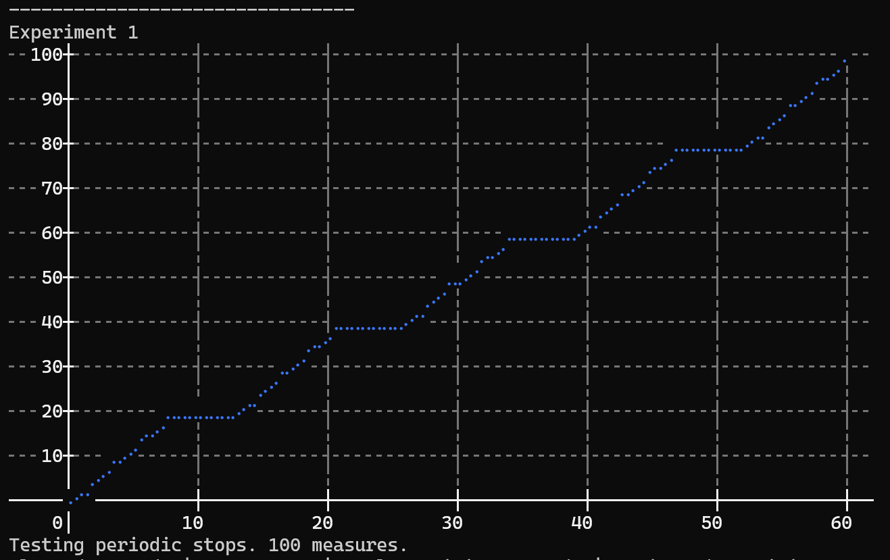

# Progress Time Estimation
Simple algorithm to estimate the remaining time of a task.

The goal is NOT to provide the most accurate estimation, but to have the best user experience.

- Remaining time always decrease. (It is jarring when the time jumps up and down.)
- It is better to announce a long remaining time in the beginning, then quickly reduce it as the task goes on.
- The remaining time should not stay on the same value too long. Users need permanent feedback to understand that the task is not stuck.

## How to use it ?

The algorithm is contained in the file: [RemainingTimeEstimator.cs](ProgressTimeEstimation/RemainingTimeEstimator.cs).
To use it, simply copy the file into your project.

```csharp
var timeEstimator = new RemainingTimeEstimator(totalSteps: 200);

timeEstimator.Start();
for (int i=0; i < 200; i++)
{
	// Process your task here.

	TimeSpan remainingTime = timeEstimator.Update(i+1);
	Console.WriteLine(remainingTime);
}

```


## Demo
The rest of the code is a demo. It's a simple console app with test scenarios.
Thanks to [Sumrix's ConsolePlot](https://github.com/Sumrix/ConsolePlot/) for the graph library.



*Scenario example. Task of 60 seconds and 100 steps. 4 times the task doesn't progress during 5 seconds.*

## Glossary

| Name | Description | Example |
| ---- | ----------- | ------- |
| Task | Any process that takes a significant amount of time to complete. The user must be informed of the time it will take to finish. | Compressing files into an archive. |
| Step | A measurable iteration of the task. The algorithm needs to know the total amount of steps before the task starts. | kB processed or number of files processed. |
| Remaining time | The time left for the task to finish. Each time the task has progressed, the remaining time can be updated. | 3 minutes and 27 seconds left |
| Speed | Steps per second. Algorithm uses the average speed and an estimated speed. | 204.76 kB/sec |
| Max estimated time | The maximum time a task would take in the worst case scenario. Can be used by the programmer to set the first remaining time when the task starts. | Worst speed = 10kB/s ; Total steps = 50MB -> Max time = 1H 23M 20S |
